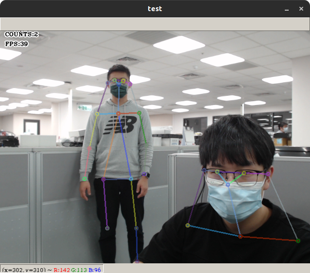

# tensorrt_pose_esimation
pose estimation for tensorrt. 


## Reference
[NVIDIA-AI-IOT/trt_pose](https://github.com/NVIDIA-AI-IOT/trt_pose)


## Feature
1. Use the classical tensorrt python api, not torch2trt.
    * TensorRT API is faster than torch2trt ( original )
        1. torch2trt: <a style="color:Red"> 2.683s </a>
        2. tensorrt python api: <a style="color:Green"> 0.002s (better) </a> 
2. Integrate with Docker and provide a cleaner environment.
3. Simplify architecture.
4. More automatical

## Workflow
1. Build the docker image `./docker/build.sh`
    ```shell
    ./docker/build.sh
    ```
2. Run the docker container `./docker/run.sh`
    ```shell    
    ./docker/run.sh /dev/video      # run with camera
    ./docker/run.sh                 # run without camera
    ```
3. Download and convert models - `download_model.sh`
    * Run
        ```shell
        cd ./demo && ./download_model.sh
        ```
    * Select 
        ```
        /****************************************************************************************************/
        /*                                                                                                  */
        /*    Index   Name                                 Jetson Nano   Jetson Xavier   Weights            */
        /*    1       resnet18_baseline_att_224x224_A      22            251             download (81MB)    */
        /*    2       densenet121_baseline_att_256x256_B   12            101             download (84MB)    */
        /*                                                                                                  */
        /****************************************************************************************************/
        Please enter the index you want to download [<idx>/all] : 1

        ```
    * Convert
        ```shell
        /*******************************************************************/
        /*                                                                 */
        /*    Index  File Name                                             */
        /*    1      /trt-pose/demo/resnet18_baseline_att_224x224_A.pth    */
        /*                                                                 */
        /*******************************************************************/
        Please enter the index you want to convert [<idx>/all] : 1
        ```
4. Run inference
    * testing - `test_infer.py`
        * run
            ```shell
            cd demo
            python3 test_infer.py \
            --engine=./resnet18_baseline_att_224x224_A.engine \
            --json=./human_pose.json 
            ```
        * results
            ```shell
            Get human pose parser ... 0.001s
            Load model ... 6.573s
            Do inference with testing data ... 0.002s (FPS:27988)
            ```
    * inference with camera - `inference.py`
        * run
            ```shell
            cd demo
            python3 inference.py \
            --engine=./resnet18_baseline_att_224x224_A.engine \
            --json=./human_pose.json 
            ```
        * results
            